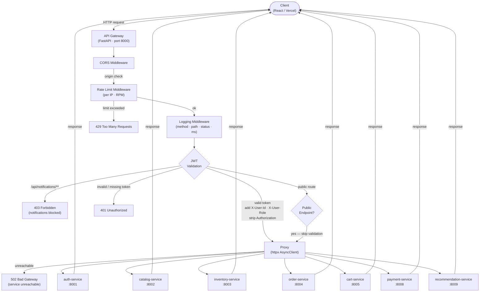

# Design — MicroShop API Gateway

## Request Flow



---

## Module Breakdown

### `config.py`
Loads all environment variables using `python-dotenv`.
Exposes a `Settings` dataclass used by every other module.
Validates that required vars are present at startup.

### `auth.py`
- `PUBLIC_ROUTES`: set of `(method, path)` tuples that skip JWT validation.
- `INTERNAL_ROUTES`: path prefixes blocked from external access.
- `validate_token(token: str) -> dict`: decodes JWT with `python-jose`, returns claims.
- `get_token_claims(request) -> dict | None`: extracts Bearer token from headers and calls `validate_token`.

### `router.py`
- `ROUTE_TABLE`: ordered list of `(prefix, env_var_name, service_name)` tuples.
- `resolve_service(path: str) -> tuple[str, str]`: returns `(base_url, service_name)` for a given path.
- `proxy_request(request, target_url, user_claims)`: builds and sends the httpx request,
  strips `Authorization`, injects `X-User-Id` / `X-User-Role`, returns a `StreamingResponse`.

### `middleware/cors.py`
Configures FastAPI `CORSMiddleware` with values from `Settings`.

### `middleware/rate_limit.py`
In-memory sliding window counter per IP.
Uses `asyncio.Lock` to be concurrency-safe.
Returns 429 when the window is full.

### `middleware/logging.py`
`BaseHTTPMiddleware` subclass.
Records timestamp before calling `call_next`, logs after response.
Never reads or logs the `Authorization` header value.

### `main.py`
- Creates the FastAPI app.
- Registers all middleware (order: CORS → RateLimit → Logging).
- Defines the catch-all route `/{path:path}` that runs auth checks and calls `proxy_request`.
- Defines `GET /health`.

---

## Data Flow for an Authenticated Request

```
1. Client sends:   POST /api/orders/ + Authorization: Bearer <token>
2. CORS:           Origin header checked against FRONTEND_URL
3. Rate Limit:     IP counter incremented; 429 if over limit
4. Logging:        Start timer, record method + path
5. Auth check:     /api/orders/ is not public → validate JWT
6. JWT valid:      Extract user_id=42, role=customer
7. Proxy:          Build httpx request to ORDER_SERVICE_URL/api/orders/
                   Headers: strip Authorization, add X-User-Id: 42, X-User-Role: customer
8. Downstream:     Returns 201 JSON
9. Logging:        Record status=201, latency=87ms
10. Client:        Receives 201 JSON as-is
```

---

## Environment Variables

| Variable                 | Required | Default | Description                        |
|--------------------------|----------|---------|------------------------------------|
| AUTH_SERVICE_URL         | yes      | —       | Full base URL of auth-service      |
| CATALOG_SERVICE_URL      | yes      | —       | Full base URL of catalog-service   |
| INVENTORY_SERVICE_URL    | yes      | —       | Full base URL of inventory-service |
| ORDER_SERVICE_URL        | yes      | —       | Full base URL of order-service     |
| CART_SERVICE_URL         | yes      | —       | Full base URL of cart-service      |
| NOTIFICATION_SERVICE_URL | yes      | —       | Full base URL of notification-service (internal only) |
| PAYMENT_SERVICE_URL      | yes      | —       | Full base URL of payment-service   |
| RECOMMENDATION_SERVICE_URL | yes    | —       | Full base URL of recommendation-service |
| JWT_SECRET               | yes      | —       | Shared secret with auth-service    |
| FRONTEND_URL             | yes      | —       | Allowed CORS origin                |
| RATE_LIMIT_RPM           | no       | 60      | Requests per minute per IP         |
| PORT                     | no       | 8000    | Uvicorn listening port             |

---

## Security Decisions

| Decision | Rationale |
|---|---|
| Strip `Authorization` before forwarding | Downstream services receive only `X-User-Id` / `X-User-Role`; the raw JWT is not exposed further |
| Block `/api/notifications/**` at gateway | Notification service is internal infrastructure; no client should call it directly |
| Never log `Authorization` value | Prevents JWT leakage in log aggregators |
| Rate limit per IP | Protects against brute-force on public auth endpoints |
